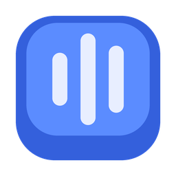

<div align="center">
  
  <h1>Typeback</h1>
  <p><strong>Give your keyboard a voice.</strong></p>
</div>

Typeback makes a sound every time you press a key — a proper mechanical one, not a
beep. It works in Chrome, VS Code, Windows Terminal, Notepad, your game launcher,
everywhere. It lives in the tray and otherwise stays out of your way.

Membrane laptop keyboards are silent and a bit dead to type on. This fixes that
without spending £150 on a keyboard.

---

## Install

No release is published yet, so for now build it yourself — see
[Build it yourself](#build-it-yourself) below. `npm run dist` produces an
installer in `dist/`.

Once it's installed it starts in the tray with a keycap icon.

- **Left click** the tray icon to mute or unmute.
- **Double click** it to open settings.
- **Ctrl + Alt + M** mutes it from anywhere, including inside games.

## The sounds

Four packs ship with it:

| Pack | Sounds like |
| --- | --- |
| **Thock** | Deep and muted. A lubed linear in a foam-filled case. |
| **Click** | Sharp and snappy. What people picture when you say "mechanical". |
| **Cream** | Soft and rounded. Quiet enough for an office. |
| **Typewriter** | Metallic, with a ringing tail. Best in small doses. |

Six key groups each get their own sound — normal keys, spacebar, backspace,
enter, modifiers and numbers — so the spacebar thuds lower than the letters, the
way a real board does.

Every sound is **synthesised from scratch**, not sampled from a real keyboard.
That means no licensing mess, and you can tweak the packs yourself: the whole
generator is [one Python file](tools/generate_packs.py). Change a number, run
`npm run packs`, and you have a new pack.

## Making it feel real

A recording played back identically every keystroke sounds like a machine gun,
which is the usual tell that an app like this is fake. Typeback avoids it:

- **Pitch and volume jitter** on every press, so no two keystrokes match.
- **Four alternates per key group**, and it never plays the same one twice in a row.
- **Release sounds** — a quieter click when you let go of a key.
- **Held keys make one sound**, not thirty, even though Windows fires a keydown
  event about thirty times a second while you hold one down.

## Playing nicely with other apps

**Opera GX** already has its own keyboard sounds. Running both gives you a weird
double-click, so Typeback mutes itself in Opera GX out of the box. You can drop
any other app into the same list in Settings — there's a button that just mutes
whatever app you're currently in.

## Two things worth knowing

**Admin windows are silent.** Windows won't send keystrokes from an elevated
program to a normal one, so typing in an admin terminal makes no sound. That's a
security boundary in the OS, not a bug. Run Typeback as admin if you need it.

**It only listens.** Typeback uses a low-level keyboard hook to know *that* a key
was pressed and which group it belongs to. It never blocks, changes or records
what you type, and nothing leaves your machine — there's no network code in it at
all.

## Bring your own sounds

Settings → **Import pack**, and pick a folder. Two kinds work:

- A folder with a `pack.json` in it — used as-is.
- A folder of loose `.wav`/`.mp3` files — Typeback reads the filenames and writes
  the manifest for you. Call a file `space.wav` or `backspace-2.wav` and it lands
  in the right group; put files in an `up/` folder and they become release sounds.

Full format: [docs/sound-packs.md](docs/sound-packs.md).

## Build it yourself

```bash
git clone https://github.com/M0hid-ai/typeback
cd typeback
npm install

npm start          # run it
npm run packs      # regenerate the default sounds (needs python + numpy + pillow)
npm run dist       # build the Windows installer
```

## How it works

```
uiohook (WH_KEYBOARD_LL)  →  keycode → group  →  gate  →  Web Audio
     global key hook           keymap.js       enabled?   hidden window
                                               muted app?
```

The key hook and the app-detection FFI live in Electron's main process; the audio
runs in a hidden renderer window, because Web Audio is the lowest-latency way to
fire short samples on Windows without writing a native audio backend. The focused
app is polled on a timer rather than checked per keystroke, so the path between
pressing a key and hearing it stays as short as possible.

## Licence

MIT — see [LICENSE](LICENSE).
